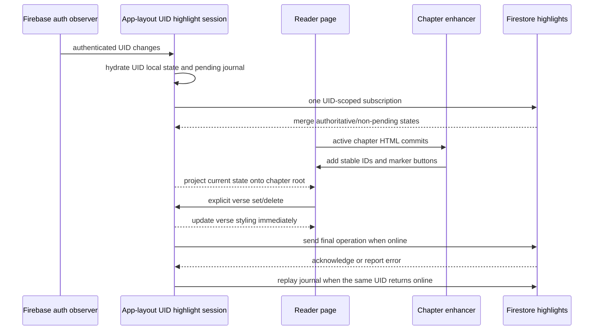
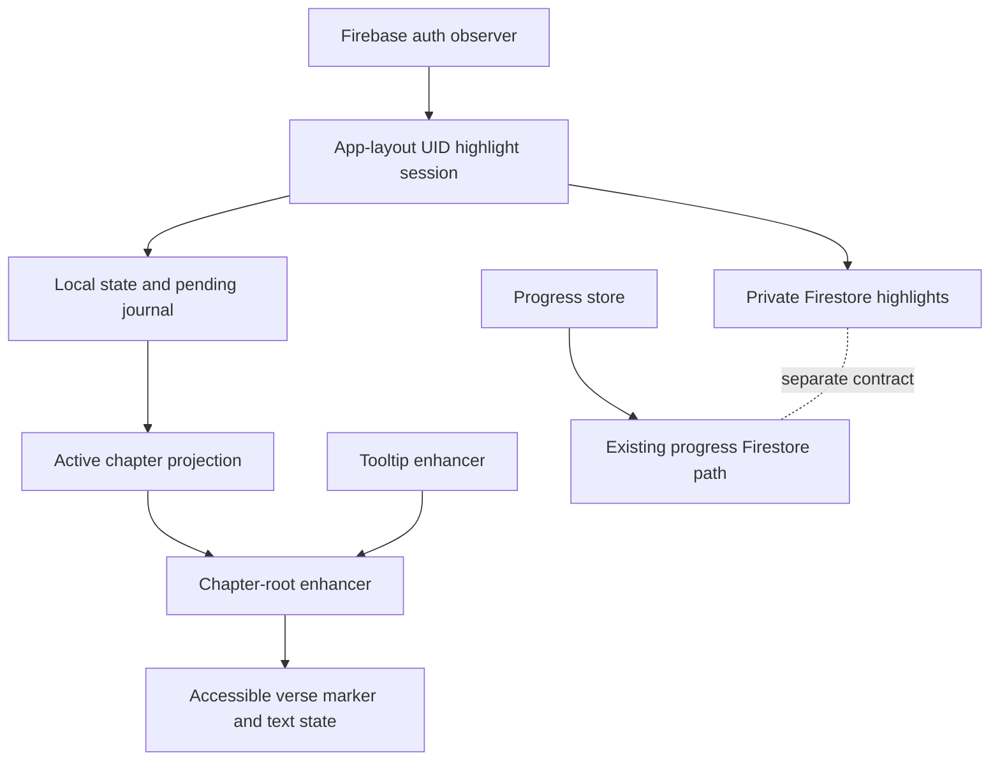

# feat: Add verse highlighting

## Overview

Add a quiet, one-tap way for an authenticated reader to highlight or unhighlight a Bible verse. The verse text remains the reading surface; the verse number becomes an accessible toggle. Highlight state is available offline, scoped to the signed-in user, and synchronized to Firestore without touching chapter-completion progress.

---

## Problem Frame

BibleTogether currently renders trusted chapter HTML and supports completion tracking, but readers cannot mark passages they want to revisit. The requested v1 is deliberately narrow: a boolean highlight per verse, not arbitrary text annotation. The implementation must fit the existing raw-HTML reader, preserve the offline-first chapter experience, and avoid introducing a second social or dashboard-like workflow.

No relevant requirements document exists under `docs/brainstorms/`; this plan is based on the request and the clarified scope: **verse highlights (one default highlight toggled per verse)**.

---

## Requirements Trace

- **R1. Verse toggle:** A reader can activate a dedicated control for a verse to toggle its default highlight on and off.
- **R2. Stable persistence:** Highlight state is keyed by canonical book/chapter/verse identity, survives chapter navigation and reloads, and is isolated per authenticated user.
- **R3. Offline-first sync:** Cached chapter content and locally saved highlights remain usable offline; pending changes synchronize when Firestore is available again.
- **R4. Safe private storage:** Highlights use a private per-user Firestore path with validation and do not overwrite or merge into the existing reading-progress document.
- **R5. Accessible, restrained UI:** Toggle controls support keyboard and assistive technology, retain visible focus, work with text zoom and reduced motion, and use a subtle reading-room-appropriate visual treatment.
- **R6. Failure containment:** Missing chapter content, malformed verse markup, auth changes, sync failures, and duplicate enhancement runs do not corrupt rendered Scripture or silently leak another account's highlights.

---

## Scope Boundaries

- No arbitrary text selection or `Selection`/`Range`-based annotation.
- No highlight colors, notes, bookmarks, sharing, search, highlight list, or bulk management UI.
- No highlighting controls for intro chapter `0`.
- No migration or redesign of the existing Bible completion data model.
- No user-facing highlight analytics or community visibility.
- No account-deletion flow or deletion-management UI; the app has no permanent account-deletion path today, and future account deletion must include cleanup of the private highlight collection and local UID cache.
- No new user-supplied HTML surface. The existing downloaded Bible HTML trust model is not broadened by this feature; full asset integrity/sanitization hardening is separate work.
- No persistent Firestore remote cache in v1; the UID-scoped local record and pending journal are the reload/offline durability source. Firestore remote-cache persistence can be added only if a later requirement proves it necessary.

---

## Context & Research

### Relevant Code and Patterns

- `src/routes/(app)/bible/[scroll]/[chapter]/+page.svelte` renders chapter HTML, owns chapter lifecycle, and already coordinates progress, zoom, loading, and tooltip enhancement.
- `src/routes/(app)/bible/[scroll]/[chapter]/tooltip.ts` post-processes injected HTML; its global query and timer should be narrowed to the active chapter root while adding highlight enhancement.
- `src/routes/(app)/bible/[scroll]/[chapter]/bibleCheckbox.svelte` is the existing pattern for accessible reader controls and restrained completion feedback.
- `src/lib/bible/progress.ts` and `src/lib/userSettings.ts` use `svelte-persisted-store` with cross-tab synchronization. Reuse that persistence approach, but use a UID-scoped key rather than the global progress key.
- `src/lib/firebase/firestore.ts` owns Firestore access. Highlight operations must be separate from `uploadBibleProgress()` because that function writes the whole progress document.
- `src/routes/+layout.ts` and `src/routes/+layout.svelte` currently resolve auth for the initial render but do not expose a long-lived UID transition boundary; account switching must not rely on `session.loggedIn` alone.
- The bundled chapter markup uses numeric `<b>` verse markers followed by verse text spans; the enhancer should use that existing structure defensively rather than relying on DOM position globally.
- `PRODUCT.md` and `DESIGN.md` require Bible-first composition, mobile-first controls, dark-mode contrast, offline support, restrained accents, and reduced-motion support.

### Institutional Learnings

- No initialized `docs/solutions/` learnings repository or direct verse-highlighting implementation was found.
- Existing project history reinforces two constraints: keep Bible content separate from user state, and prefer `svelte-persisted-store` over the abandoned custom local-store abstraction.

### External References

- [Svelte `{@html}`](https://svelte.dev/docs/svelte/%40html): injected markup does not compile Svelte handlers and is not covered by scoped styles; use a compiled parent handler and root-scoped DOM enhancement.
- [Svelte event delegation](https://svelte.dev/docs/svelte/basic-markup#Events-Event-delegation): supports one handler on the reader surface for generated verse controls.
- [Firebase Firestore listeners](https://firebase.google.com/docs/firestore/query-data/listen): use explicit unsubscribe cleanup, optimistic writes, and pending-write metadata where needed. v1 uses the app's durable local journal instead of persistent Firestore remote caching.
- [WAI-ARIA button pattern](https://www.w3.org/WAI/ARIA/apg/patterns/button/): use native buttons with pressed-state semantics for the verse toggle.

---

## Key Technical Decisions

- **Use the verse number as the toggle, not the whole verse.** The marker is a small, discoverable native button while the text remains selectable and the existing tooltip controls cannot become nested inside another interactive element.
- **Use `BOOK_CODE:CHAPTER:VERSE` as the v1 canonical ID.** The app currently ships one bundled Bible source and has no translation dimension; adding one now would be speculative. Normalize book codes to the existing uppercase constants, reject leading-zero aliases, and require positive numeric components. Use the same ID in local state, DOM data, and Firestore document paths. If translations are introduced later, add that dimension before sharing IDs across sources.
- **Store sparse highlighted IDs plus a durable per-UID pending journal locally.** A sparse set avoids allocating every verse. Pending set/delete intent is persisted separately so an offline unhighlight cannot resurrect after reload or a cached remote state. Retain the old UID's local cache for offline re-login, but never hydrate or flush it under a different UID; document that browser caches are not confidentiality boundaries.
- **Store one Firestore document per highlighted verse at `userData/{uid}/privateHighlights/{verseId}`.** This is a valid collection/document hierarchy. The document contains only `highlighted: true`; unhighlighting deletes the document. The path is private, owner-only, and independent from the existing progress document.
- **Use one Firestore subscription per authenticated UID, not per chapter.** The app layout exclusively owns the highlight session; the root layout owns live Firebase auth observation; the chapter page only projects the current highlight state onto its active DOM root. This avoids listener churn and stale remote callbacks during chapter navigation.
- **Treat local state as optimistic and explicit.** A toggle records the desired final state (`set` or `delete`) with a globally unique operation identity and per-verse sequence. An acknowledgement may clear only the matching current operation. Cached snapshots cannot clear local state; only explicit remote document changes reconcile non-pending IDs, never snapshot absence. Remote concurrent writes use Firestore's commit-order last-write-wins; v1 adds no custom cross-device conflict protocol.
- **Use the local journal, not persistent Firestore caching, for reload/offline durability.** Do not add `initializeFirestore` persistence in v1. Cloud writes are attempted only for the captured authenticated UID when the client is online; offline changes remain in the journal and replay when that same UID returns. This avoids coordinating two durable caches and keeps auth fencing in application-owned state.
- **Keep the existing completion document untouched.** The current progress/rules paths and schemas are inconsistent; this feature should not deepen that coupling or repair legacy data as part of highlight work.

---

## Open Questions

### Resolved During Planning

- **What is highlighted?** A single default boolean highlight per canonical verse; no colors or notes.
- **What is clickable?** The verse-number control only; the verse text remains natively selectable and clicking/long-pressing text does not toggle.
- **What is copied?** Preserve the current reader behavior: visible verse numbers remain part of native selection/copy where the old `<b>` marker was included, and no extra marker text is duplicated. The generated control is adjacent to the verse text, not a selection handler; no custom `Selection`/`Range` manipulation is added.
- **What wins during sync conflict?** Firestore commit-order last-write-wins for remote concurrent writes; pending local intent is retained until the matching operation is acknowledged or replaced by a newer local operation.
- **How is unhighlighting stored?** Delete the per-verse Firestore document and remove the ID from the steady-state local set; retain a pending delete journal entry until its operation is confirmed.
- **Are intro chapters included?** No; chapter `0` receives no controls.
- **What happens on cloud failure?** Keep the local highlight or pending unhighlight, expose a non-blocking unsynced/error state, and retry only the latest final state when connectivity/auth returns. Permission failures remain visible and are not retried indefinitely.
- **What is the auth source of truth?** A live Firebase auth observer with a UID/generation boundary, not a mutable `loggedIn` boolean or a lazy read of whichever user is current when a retry runs.
- **What are the v1 status states?** `ready`, `pending`, `saved locally`, `degraded durability`, and `sync error`. Successful local toggles update silently; `saved locally` means the UID record was persisted; `degraded durability` means memory-only intent may be lost on reload; `sync error` includes one explicit retry action and never reverts the local state.
- **What is the visual treatment?** A low-opacity, highlight-specific accent-gold background on verse text, unchanged text color, no layout shift, a minimum 24px marker hit area, a visible soft-ring focus style, and no density-dependent layout change. Highlight state is also exposed with `aria-pressed`, not color alone; the same treatment must remain readable for sparse and densely highlighted chapters.

### Deferred to Implementation

- The exact DOM grouping needed for unusual bundled verse markup after the first committed fixture is inspected; unsupported marker shapes must be skipped without changing Scripture text.
- Account-deletion cleanup for retained local/Firestore highlight data; v1 must not silently delete offline intent on logout, and a later account-lifecycle task can define deletion retention precisely.
- Full downloaded-Bible asset integrity/sanitization/CSP hardening; this feature adds no user-supplied HTML and only acts on route-derived IDs from recognized markers.

---

## High-Level Technical Design

> *This illustrates the intended approach and is directional guidance for review, not implementation specification. The implementing agent should treat it as context, not code to reproduce.*

The reader uses one compiled click handler on the active `.bible` root. The enhancer only annotates existing trusted markup and applies state attributes/classes; it does not embed Svelte handlers in `{@html}` output. Tooltip enhancement remains separate and root-scoped.

---

## Implementation Units

- [x] U1. **Define canonical verse identity and UID-scoped local state**

**Goal:** Provide the pure identity, sparse local state, durable pending-operation contract, and minimal projection API that the reader and Firestore adapter can share without knowing each other's transport details.

**Requirements:** R2, R3, R6

**Dependencies:** None

**Files:**
- Create: `src/lib/bible/highlights.ts`
- Create: `src/lib/bible/highlights.test.ts`

**Approach:**
- Define canonical IDs and normalization using existing book/chapter constants and `isChapterValid`, with an explicit `chapter > 0` guard so intro chapter `0` cannot become highlightable; do not duplicate the validator's other checks or claim semantic verse-range validation that the repository does not model.
- Persist a versioned per-UID record containing the sparse highlighted ID set and a pending journal keyed by verse ID. Each pending entry stores the desired final operation and a globally unique operation identity/sequence.
- Keep pending deletes even though false IDs are absent from the steady-state set. A retry or rehydration must not resurrect a deleted verse from stale remote state.
- Expose a small state projection with readiness, highlighted IDs, pending IDs, and sync status; expose operations for hydrate, set, delete, retry, and teardown without embedding Firestore imports.
- Validate/quarantine malformed local data, preserve in-memory intent on storage quota failure, and expose degraded durability without logging raw records, UIDs, or verse IDs.
- Do not promise atomic cross-tab local merges in v1. Firestore listener updates for the same UID are covered; local persisted-store races remain a documented limitation until a real requirement demands a stronger store.

**Patterns to follow:**
- `src/lib/bible/progress.ts` for persisted stores and Bible constants.
- `src/lib/userSettings.ts` for cross-tab persisted state.
- `src/lib/bible/bible.ts` for existing chapter validation.

**Test scenarios:**
- **Happy path:** Canonical `GEN:1:1` and `1SA:3:4` IDs normalize consistently and round-trip in local state.
- **Edge case:** Lowercase book codes normalize to the existing uppercase constants; leading-zero chapter/verse components, unknown books, chapter `0`, and non-positive values are rejected without alias duplication.
- **Happy path:** Setting an ID adds it to the sparse set; deleting it removes it from the sparse set and leaves a pending delete entry.
- **Edge case:** Rehydrating malformed, oversized, or legacy local data returns a safe empty/partial state without throwing or mixing users.
- **Edge case:** Rapid set → delete → set operations retain only the latest desired operation for that verse and its latest operation identity.
- **Error path:** Local storage quota/unavailability preserves in-memory intent and reports degraded durability.
- **Integration:** Two UID-scoped records cannot hydrate one another's highlighted or pending IDs.

**Verification:**
- The module has no Firestore dependency and cannot write reading progress.
- Pending deletes survive reload and remain associated with their original UID.
- Local state exposes one canonical ID and one versioned contract to later units; transport flush isolation is verified by U5.

---

- [x] U5. **Add the UID-bound Firestore sync session**

**Goal:** Synchronize the local contract to a private Firestore subcollection with safe auth transitions and explicit emulator routing, while leaving reload durability to U1.

**Requirements:** R2, R3, R4, R6

**Dependencies:** U1

**Files:**
- Modify: `src/lib/firebase/firestore.ts`
- Modify: `src/lib/firebase/firebase.ts`
- Create: `src/lib/firebase/authState.ts`
- Modify: `src/lib/firebase/auth.ts`
- Modify: `src/routes/+layout.ts`
- Modify: `src/routes/+layout.svelte`
- Modify: `src/routes/(app)/+layout.svelte`
- Modify: `src/routes/(user)/googleSigninButton.svelte`
- Modify: `src/routes/(app)/settings/logoutButton.svelte`
- Modify: `.env.example`
- Create: `src/lib/firebase/highlights.test.ts`

**Approach:**
- Expose explicit UID-bound adapter/session operations for the U1 projection. Capture the UID and auth generation when a session starts; verify both before every retry and callback so user A's pending work cannot execute under user B.
- The shared auth-state module exclusively owns the live `onAuthStateChanged` observer; `src/routes/+layout.ts` consumes its initial state without installing a second observer, and `src/routes/+layout.svelte` projects it into `session`. Login, Google sign-in, logout, and initial route loading all call the shared auth-state transition API rather than writing `session` directly. The app layout exclusively owns one highlight session for the current UID, alongside—but independent from—the existing progress subscription. The chapter page never starts a Firestore listener.
- Use `setDoc` with `{ highlighted: true }` for set operations and `deleteDoc` for deletes at `userData/{uid}/privateHighlights/{verseId}`. Deduplicate retries to one final operation per verse; an acknowledgement clears a pending entry only when its operation identity still matches.
- Treat cached/in-memory snapshots as additive for pending IDs. Never clear a local ID merely because it is absent from a snapshot. For an explicit `removed` document change, confirm absence with a server read while the captured UID/session is still current before clearing a non-pending ID; a pending delete is cleared by its matching successful delete operation, not by document absence.
- Attempt cloud mutations only for the captured authenticated UID while the browser is online. Offline changes remain in U1's journal and replay when that same UID returns. A stale in-flight result after auth teardown is ignored; no retry reads mutable `firebaseAuth.currentUser` to choose a new owner.
- Retain local state and pending intent on transient or permission failures, distinguish permanent permission failures from reconnectable failures, and retry only on a later reconnect/auth session or the explicit retry action—not an unbounded loop.
- Correct the Firestore emulator target to `127.0.0.1:8080` and Auth to `127.0.0.1:9099` behind a positive `PUBLIC_USE_FIREBASE_EMULATOR` flag that defaults off in production and aborts initialization when enabled without reachable emulators. Do not add persistent Firestore remote caching in v1; use the default memory cache and the U1 journal for reload recovery. The client must fail closed in emulator tests rather than fall back to production.

**Patterns to follow:**
- Existing modular Firestore imports and auth singleton in `src/lib/firebase/firestore.ts` and `src/lib/firebase/firebase.ts`.
- Existing app-layout unsubscribe lifecycle, corrected so the handle is cleared and UID-bound.
- `src/lib/session.svelte.ts` as the reactive session projection, with Firebase auth as the source of truth.

**Test scenarios:**
- **Happy path:** A set operation writes exactly one owner-scoped document; a delete removes exactly that document and never touches `bibleProgress/{uid}`.
- **Edge case:** A cached/empty snapshot does not erase a locally highlighted ID or pending delete; an explicit remote removal is applied only after a current server read confirms absence, and the matching successful operation clears a pending delete.
- **Edge case:** An acknowledgement followed by a stale removal event cannot erase a just-saved highlight; the server-read confirmation or current operation identity blocks it.
- **Edge case:** Set → delete → set acknowledgements arriving out of order cannot clear the newest operation identity.
- **Edge case:** Sign out A → sign in B while A has journaled work; B receives no A state, and A's journal is not replayed until A returns.
- **Error path:** Listener/read/write failure retains local state, reports a redacted sync error, and allows a later reconnect/explicit retry.
- **Integration:** Two tabs for one UID receive remote changes without replacing unrelated remote IDs; the v1 test does not claim atomic local-store merging.

**Verification:**
- There is at most one highlight listener per authenticated UID and no listener churn on chapter navigation.
- Every adapter operation is tied to the UID that created it and cannot be rerouted by a later `currentUser` lookup.
- Emulator and production configuration are explicit; tests cannot silently target a production Firebase project.

---

- [x] U2. **Enhance rendered verses without breaking tooltips**

**Goal:** Turn the existing numeric verse markers into accessible toggle targets and apply highlight state to the corresponding verse text without rewriting chapter HTML or nesting interactive elements.

**Requirements:** R1, R2, R5, R6

**Dependencies:** U1

**Files:**
- Create: `src/routes/(app)/bible/[scroll]/[chapter]/highlight.ts`
- Create: `src/routes/(app)/bible/[scroll]/[chapter]/highlight.test.ts`
- Modify: `src/routes/(app)/bible/[scroll]/[chapter]/tooltip.ts`
- Modify: `package.json` and `bun.lock` to add `jsdom`; activate it with the file-level Vitest environment directive in `highlight.test.ts` so other unit tests remain on their existing environment

**Approach:**
- Accept the active chapter root and current route rather than querying `document` globally. Locate existing numeric marker/text-span pairs, derive canonical IDs, and annotate only that root.
- Replace or enhance the verse-number presentation as a native button with `type="button"`, stable accessible name `Highlight verse {number}`, `aria-pressed`, a stable generated-marker attribute, and visible focus. Use the same `data-verse-id` value on marker and associated text; do not use duplicate HTML `id` attributes.
- Make the button a separate inline control with a minimum 24px hit area. Text remains natively selectable/copyable; selection across a marker follows browser behavior, and only activation on the button toggles.
- Mark the associated text span with a state attribute/class; do not make the entire verse an interactive wrapper, because tooltip triggers live inside verse text. Preserve exact text and skip unsupported shapes or any marker under an interactive ancestor without throwing.
- Make enhancement idempotent: repeated runs update existing generated buttons and text attributes rather than duplicating controls or per-button listeners. The compiled reader root handles all clicks.
- Update `setupTooltip` to receive the current root, mark processed nodes, and return cleanup/unmount handles when its Popover instances are replaced. Keep tooltip replacement separate from highlight controls.
- Add button reset, inline layout, quiet unpressed marker styling, subtle hover/active surface, pressed text state, WCAG AA marker/focus contrast, low-opacity highlight-specific accent-gold text-background, no-layout-shift, zoom, and reduced-motion styling in the existing reader style surface; raw HTML remains covered by `:global` selectors.
- This unit does not introduce new raw HTML or trust arbitrary `data-verse-id` values; only IDs derived from the current route and recognized marker text are actionable.

**Patterns to follow:**
- The existing `tooltip.ts` post-render enhancement and `tooltip.svelte` Popover trigger.
- `bibleCheckbox.svelte` for native control semantics and visible state feedback.
- `.bible :global(...)` styles in `+page.svelte`, since injected HTML is outside Svelte's scoped CSS.

**Test scenarios:**
- **Happy path:** First, middle, and final numeric verse markers receive expected canonical IDs and only their matching text is styled when highlighted.
- **Happy path:** Clicking a generated verse-number button toggles `aria-pressed` and text state without changing neighboring verses or exact text content.
- **Edge case:** Lowercase/forged/leading-zero data attributes do not bypass route-derived ID validation.
- **Edge case:** Markers inside links/buttons, malformed nesting, duplicate markers, and missing text targets are skipped without creating nested interactive controls.
- **Edge case:** Nested `` tooltip markup remains a separate control and is not nested inside the verse toggle; root-scoped enhancement does not touch another root.
- **Edge case:** Unpressed, hover/active, focused, and pressed marker states remain discoverable but subordinate to Scripture; marker and focus colors meet WCAG AA contrast.
- **Edge case:** Running the enhancer twice does not duplicate controls, wrappers, or tooltip mounts.
- **Error path:** Missing/non-numeric markers or unsupported marker/text shapes remain readable and do not throw.
- **Integration:** Tooltip setup after root replacement cleans up old mounts and leaves current highlight attributes intact.

**Verification:**
- The DOM contains one keyboard-operable toggle per supported verse and no nested interactive controls.
- Highlight appearance is applied to verse text, not only the tiny verse number, and does not depend on color alone for the pressed state.
- The DOM test runs in the configured Vitest DOM environment rather than relying on accidental Node browser globals.

---

- [x] U3. **Wire reader projection, lifecycle, status, and translations**

**Goal:** Connect the UID-level state session and DOM enhancer to the existing chapter page with local-first rendering, chapter cleanup, accessible feedback, deterministic browser fixtures, and design-system-compliant styling.

**Requirements:** R1, R2, R3, R5, R6

**Dependencies:** U1, U2, U4, U5

**Files:**
- Modify: `src/routes/(app)/bible/[scroll]/[chapter]/+page.svelte`
- Modify: `src/lib/locales/en.json`
- Modify: `src/lib/locales/zh.json`
- Modify: `playwright.config.ts`
- Create: `tests/highlights.spec.ts`
- Create: `tests/fixtures/highlight-chapter.html`
- Create: `tests/support/highlights.ts`
- Create: `tests/support/playwright-global.ts`

**Approach:**
- Consume the current UID-level highlight projection; do not hydrate or subscribe again per chapter. Chapter changes only reapply current state to the new root.
- Use the existing chapter content key and one lifecycle effect keyed by the active chapter root/content. After `tick` commits `{@html}` output, the effect calls an enhancer that returns `update`/`destroy`; `destroy` runs before the next root replacement and from component teardown. Track a render generation so an old async callback cannot enhance a newly rendered chapter; do not use another arbitrary timer.
- Put one compiled event-delegated handler on the `.bible` container. It resolves the nearest generated verse toggle, issues an explicit set/delete to the UID session, and updates the verse styling immediately.
- Mark the reader root `aria-busy` while auth/local hydration is pending, reserve the marker's inline geometry, and remove that state without layout shift when controls become available. If cached chapter content is unavailable, retain the existing download/retry state and do not create fake controls.
- Keep a compact global `aria-live="polite"` status with the five states defined above. Pending and saved-locally states announce once without an action; degraded durability explicitly warns that reload may lose the change; transient sync errors expose one retry for the current UID's pending operations; permanent permission errors expose no retry and use re-authentication/error copy. Use localized copy: `Highlight verse {number}` / `標記第 {number} 節`; `Saved locally; will sync when online.` / `已儲存於本機，連線後同步。`; `Saved for this session only; it may be lost on reload.` / `僅儲存於本次工作階段，重新載入後可能遺失。`; `Highlight saved locally. Sync failed.` / `標記已儲存於本機，但同步失敗。`; and `Retry sync` / `重試同步`. Keep success quiet, preserve local state on errors, scope retry to the current UID's pending operations, and never steal focus for a status update.
- Use sequential document-order tab stops for the generated verse buttons; arrow-key navigation and roving tabindex are not part of v1. Preserve focus on the marker while toggling. If auth teardown removes the focused marker, move focus to the chapter heading; on chapter replacement, restore focus only when the same verse exists in the new root, and never move focus merely because a live status changes.
- Add committed fixture markup matching the current `<b>1</b>...` shape, including first/middle/final verses, nested tooltip markup, and hostile interactive ancestors. Seed it into the existing IndexedDB schema in `tests/support/highlights.ts`; create an email-verified Auth emulator user before navigation, set `firstVisit` to false before app startup, and seed `{ name, data }` before `loadChapter` runs.
- Make all browser emulator setup and production-endpoint blocking owned by this unit through `tests/support/playwright-global.ts`. Register that module as Playwright `globalSetup` and require its returned teardown to stop emulators. Start/wait for Auth and Firestore emulators, inject `PUBLIC_USE_FIREBASE_EMULATOR=true`, sign the browser in with the seeded verified emulator credentials before protected navigation, seed IndexedDB before `loadChapter`, tear emulators down after the run, and configure Playwright's web server to use the Vite preview port `4000` with `vbuild` (not the production-only helper-fetching build); declare `firebase-tools` as the reproducible test dependency.

**Patterns to follow:**
- Existing `onMount`/`onDestroy` lifecycle usage in the reader and app layout.
- Existing `$state`/`$derived`/`$effect` usage in `+page.svelte`.
- Existing `svelte-sonner`/localized copy patterns only if the chosen feedback surface needs a transient error announcement.

**Test scenarios:**
- **Happy path:** Authenticated pointer activation highlights a verse immediately, persists it after reload, and unhighlighting removes it locally and remotely.
- **Happy path:** Keyboard focus and Enter/Space activation produce the same result as pointer activation; `aria-pressed`, stable accessible name, tab order, and focus retention remain correct.
- **Edge case:** Native text selection/long-press on verse text does not toggle; existing verse-number copy behavior is preserved, and generated marker controls remain separate from copied Scripture text behavior.
- **Edge case:** Switching chapters removes the previous chapter's controls/listeners and preserves highlights by canonical ID when returning.
- **Edge case:** Signing out or switching from user A to user B never renders user A's local or remote highlights for user B.
- **Edge case:** At 50%, 100%, and 200% persisted reader zoom on viewport `375x667`, the 24px marker hit area, sequential tab order, focus ring, text wrapping, safe-area/navigation spacing, WCAG AA marker/focus contrast, and highlight readability remain intact; sparse and densely highlighted fixtures remain Bible-first.
- **Edge case:** With `prefers-reduced-motion: reduce`, all new highlight, focus, status, and retry transitions are removed or reduced without changing state semantics.
- **Error path:** Cached chapter content remains highlightable while offline; a failed sync keeps the local highlight or unhighlighted state and announces `saved locally`/`sync error` without blocking reading. A storage failure announces the session-only degraded-durability copy instead of promising reload persistence.
- **Error path:** Missing chapter content does not render fake highlight controls and retains the existing download/retry behavior.
- **Integration:** Offline set, reload, reconnect, and offline delete/reload/reconnect preserve the latest explicit state without highlight resurrection.
- **Integration:** Sign out A while journaled work exists, sign in B, then return to A; no stale callback or retry crosses the UID boundary.

**Verification:**
- The normal reading flow remains open → read → optionally highlight → check complete; no modal or navigation detour is introduced.
- Existing chapter completion, audio/navigation controls, tooltip behavior, and zoom remain unchanged.
- The rendered reader remains Bible-first and usable on mobile, keyboard input, text zoom, and reduced motion.
- Playwright owns emulator startup/seeding, uses Firestore `8080` and Auth `9099`, blocks production Firebase endpoints, and runs on the configured preview port.

---

- [x] U4. **Lock down private rules and dedicated verification**

**Goal:** Make the new Firestore path enforceable and prove the security boundary independently from browser reader tests.

**Requirements:** R3, R4, R6

**Dependencies:** U1, U5

**Files:**
- Modify: `firestore.rules`
- Create: `rules-tests/firestore.rules.test.ts`
- Create: `vitest.rules.config.ts`
- Modify: `package.json` and `bun.lock` to add `@firebase/rules-unit-testing`, `firebase-tools`, and a dedicated `test:rules` script

**Approach:**
- Add an owner-only match for `userData/{userId}/privateHighlights/{verseId}`. Allow reads for the owner, create/update only for exactly one `highlighted: true` boolean field, and delete for the owner.
- Validate the document ID format in Rules as a bounded canonical `BOOK_CODE:positive-integer:positive-integer` shape with supported book-code alternatives, chapter `1..151`, and verse `1..200`; client validation is usability only, not the security boundary. Use the existing wildcard name `userId` or pass the wildcard into an owner helper so the complete Rules file compiles. Reject aliases, oversized/malformed IDs, false/non-boolean values, and extra fields. These broad ceilings are an abuse guard, not a claim of exact semantic verse ranges.
- Make complete rules compilation/deployment an explicit prerequisite. If existing helper placement or legacy path structure prevents compilation, make the smallest structural correction without widening or redesigning legacy progress access.
- Make U4 the sole owner of rules-test discovery and invocation. The dedicated config includes only `rules-tests/**/*.test.ts`, the `test:rules` script runs that config against an isolated Auth/Firestore emulator project, the ordinary `test:unit` config remains source-only and excludes `rules-tests`, and Playwright's `testDir`/`testMatch` excludes `rules-tests`. The suite must fail rather than fall back to production.
- Add redacted error assertions only; do not log UIDs, verse IDs, paths, highlight maps, or raw snapshots.

**Patterns to follow:**
- Existing owner checks in `firestore.rules`, constrained to the new private collection.
- Existing Firebase emulator configuration in `firebase.json` and `src/lib/firebase/firebase.ts`.
- Current Playwright/Vitest split, with explicit configuration rather than relying on filename overlap.

**Test scenarios:**
- **Happy path:** Authenticated owner can read, create, update, and delete their own `highlighted: true` verse document.
- **Error path:** Unauthenticated users and authenticated users with a different UID cannot read, list, or mutate another user's highlight collection/document.
- **Error path:** `highlighted: false`, extra fields, non-boolean values, malformed IDs, leading-zero aliases, unsupported book codes, and oversized IDs are rejected; deletion is the only unhighlight operation.
- **Integration:** Existing progress rules/path behavior is not widened or required to pass highlight tests.
- **Integration:** The rules file compiles as a whole and the emulator test uses Firestore `8080`/Auth `9099`; no production endpoint is contacted. Synthetic IDs beyond the bounded chapter/verse ceilings are rejected.

**Verification:**
- Rules tests pass for owner, unauthenticated, cross-user, valid schema, invalid schema, list, update, and delete cases.
- U4 owns the dedicated rules test script, its `rules-tests/` discovery boundary, and its emulator lifecycle; browser integration scenarios are owned only by `tests/highlights.spec.ts`.
- Browser integration runs after the rules contract is verified; the two suites remain separate.

---

## System-Wide Impact

- **Interaction graph:** The root layout owns a live Firebase auth observer; the app layout owns one UID highlight session; the chapter page projects that state into raw HTML; a chapter-root enhancer adds marker controls; the reader delegates events to the enhancer output. Tooltip replacement remains a sibling root-scoped DOM enhancement. Progress synchronization stays separate.
- **Error propagation:** Local updates succeed independently of Firestore. Firestore failures become a non-blocking sync/error state and retain the pending explicit state for retry; malformed markup is skipped without blocking Scripture reading. Cloud-cache persistence is not required for reload recovery.
- **State lifecycle risks:** UID changes unsubscribe the prior listener, clear the prior rendered projection, invalidate old generations, and quarantine old pending work. Chapter changes discard old DOM enhancement and stale async callbacks without recreating the UID listener. Pending local IDs survive cached/in-memory snapshots until matching acknowledgement. If a focused control is removed, focus moves to the chapter heading; live status updates never steal focus.
- **API surface parity:** The same client-side behavior must work in the SvelteKit PWA and Capacitor Android build. No server endpoint is added. Firestore initialization must preserve SSR/build behavior and explicit emulator routing.
- **Integration coverage:** Rules tests cover the auth boundary; unit tests cover identity/state/adapter ordering; DOM tests cover enhancement idempotency; Playwright covers the actual reader, keyboard behavior, reload/offline flow, chapter navigation, and account isolation.
- **Unchanged invariants:** `bibleProgressStore`, chapter completion uploads, `queryChapterCount`, audio/navigation controls, tooltip content, and chapter HTML storage remain separate. Highlight documents never replace the progress document.

---

## Risks & Dependencies

| Risk | Mitigation |
|------|------------|
| Bundled HTML changes shape or contains a verse marker without the expected text span | Centralize defensive enhancement; cover first/middle/final and unsupported marker fixtures; leave unsupported content readable. |
| Existing `{@html}` content is a pre-existing trust boundary | Do not add user-supplied HTML or trust arbitrary verse attributes; treat full downloaded-asset integrity/sanitization as separate hardening work and do not claim this feature fixes it. |
| `{@html}` does not compile handlers and scoped styles do not apply | Use one compiled parent handler, root-scoped DOM attributes, and existing `:global` reader styles. |
| Existing Firestore code/rules and emulator ports disagree | Make emulator setup a prerequisite, use explicit Firestore `8080`/Auth `9099` configuration, and dedicate rules tests before reader integration. |
| A shared device or stale listener leaks highlights across accounts | Live auth observer, UID/generation-bound sessions, UID-scoped local records, callback invalidation, and two-account integration coverage. |
| Offline or concurrent writes erase a local highlight | Persist explicit set/delete intent and operation identities, retain pending deletes, ignore cached clearing snapshots, and document commit-order last-write-wins. |
| Duplicate retry or out-of-order acknowledgement resurrects a verse | One final in-flight operation per verse, operation-identity acknowledgement, and rapid set/delete/set tests. |
| A large highlight map exceeds Firestore document limits | Use sparse local IDs and one small Firestore document per highlighted verse. |
| Local storage persistence fails or is inspected on a shared device | Validate/quarantine local data, preserve in-memory intent, expose degraded durability, and document that local caches are not encrypted/private at rest. |
| Highlight styling competes with Scripture or fails contrast at zoom | Use low-opacity semantic accent treatment, visible focus, non-color pressed semantics, 24px target geometry, and accessibility/zoom/reduced-motion checks. |
| Browser tests run against the wrong runner, port, or Firebase project | U3 owns Playwright config/setup, the Vite preview port `4000`, and endpoint blocking; U4 owns `rules-tests/` discovery, the dedicated Rules Vitest script, and its emulator lifecycle. Both use isolated emulator data and explicit positive emulator configuration. |

---

## Documentation / Operational Notes

- No migration is required for existing users because highlights use a new private collection and a new versioned local key.
- The Firestore rules path and schema become part of the private data contract; keep the owner-only restriction if future highlight management is added.
- Retain UID-scoped local pending data across logout for offline re-login, but never hydrate it for another UID. A future permanent account-deletion flow must delete that UID's `privateHighlights` documents and local cache; no such flow exists in this feature, so v1 documents the retention boundary rather than silently deleting offline intent.
- No new analytics, rollout flag, or background service is needed for v1. Sync failures should remain observable through the reader's localized status/error path and redacted client logging only.
- If the bundled Bible gains translations or alternate versification, revisit the canonical ID before exposing highlights across sources.

---

## Sources & References

- Related code: `src/routes/(app)/bible/[scroll]/[chapter]/+page.svelte`
- Related code: `src/routes/(app)/bible/[scroll]/[chapter]/tooltip.ts`
- Related code: `src/lib/bible/progress.ts`
- Related code: `src/lib/firebase/firestore.ts`
- Project constraints: `PRODUCT.md`, `DESIGN.md`
- External docs: [Svelte `{@html}`](https://svelte.dev/docs/svelte/%40html)
- External docs: [Firebase realtime listeners](https://firebase.google.com/docs/firestore/query-data/listen)
- External docs: [WAI-ARIA button pattern](https://www.w3.org/WAI/ARIA/apg/patterns/button/)
