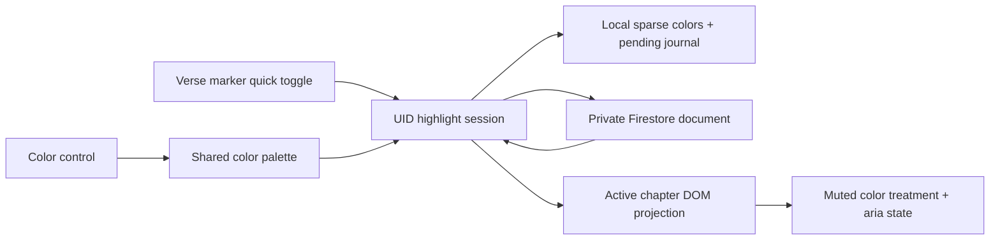

# feat: Add selectable highlight colors

## Overview

Extend the existing per-verse boolean highlight with preset colors plus a freeform picker matching the supplied hue-ring and saturation/value-square design. Existing highlights remain gold, work offline, stay private per user, and continue syncing through the current UID-bound session.

---

## Problem Frame

The current highlight feature stores only whether a verse is highlighted and renders every highlight with the same accent-gold treatment. Readers need a lightweight way to distinguish passages, including a custom color when the presets are insufficient, without introducing notes, arbitrary annotations, or a management dashboard.

The feature must preserve the Bible-first reading surface, the existing one-action toggle, local-first durability, and the current private Firestore boundary.

---

## Requirements Trace

- **R1. Preset and custom colors:** A reader can choose gold, blue, green, rose, violet, or a freeform color from the custom picker.
- **R2. Canonical persistence:** New colors are normalized to lowercase six-digit hex values; existing local and Firestore boolean highlights render as gold without data loss.
- **R3. Per-verse persistence:** A verse's selected color survives chapter navigation, reloads, offline use, and later sync for the same UID.
- **R4. Safe sync:** Recoloring uses the existing UID/generation fencing, pending journal, private collection, and owner-only rules; invalid color strings are rejected at the trust boundary.
- **R5. Accessible reader UI:** Color controls have localized names, keyboard operation, visible focus, selected-state semantics, a validated hex fallback, and do not rely on color alone.
- **R6. Restrained presentation:** Colors are rendered as bounded-opacity overlays with readable Scripture text; the selector does not add permanent clutter or compete with Scripture.

---

## Scope Boundaries

- No alpha-channel editing; custom colors are opaque six-digit hex values and the reader controls display opacity.
- No notes, text-range selection, bookmarks, filters, highlight lists, bulk recoloring, sharing, or analytics.
- No user-configurable default color; gold remains the default for a newly highlighted verse.
- No Firestore backfill or account-deletion cleanup in this feature.
- No change to chapter-completion progress or the existing auth/session ownership model.

---

## Context & Research

### Relevant Code and Patterns

- `src/lib/bible/highlights.ts` owns canonical IDs, UID-scoped persistence, pending operations, and projections.
- `src/lib/firebase/firestore.ts` owns the private highlight transport and UID/generation fencing.
- `src/routes/(app)/bible/[scroll]/[chapter]/highlight.ts` enhances raw chapter HTML and applies highlight state.
- `src/routes/(app)/bible/[scroll]/[chapter]/+page.svelte` owns reader lifecycle, delegated events, focus, translations, and Bible-first styling.
- `src/routes/(app)/bible/[scroll]/[chapter]/tooltip.svelte` and `tooltip.ts` show the existing Bits UI Popover/mount pattern.
- `src/lib/bible/highlights.test.ts`, `src/lib/firebase/highlights.test.ts`, `src/routes/(app)/bible/[scroll]/[chapter]/highlight.test.ts`, `tests/highlights.spec.ts`, and `rules-tests/firestore.rules.test.ts` already cover the feature seams.
- `PRODUCT.md` and `DESIGN.md` require restrained accents, dark-mode contrast, mobile-first controls, offline support, and reduced-motion support.

### Institutional Learnings

- No additional `docs/solutions/` learning applies. The existing verse-highlighting plan explicitly deferred colors and is the direct prior art.

### External References

- No external research is needed; the repository already has the required persistence, Firestore, DOM-enhancement, and popover patterns.

---

## Key Technical Decisions

- **Persist canonical hex values.** Presets resolve to lowercase `#rrggbb` values and custom selections are normalized to the same format. During transition, decode the prior plan's named preset IDs if they already exist, but write hex for new operations.
- **Keep the current marker as the quick toggle.** Activating an unhighlighted marker applies default gold; activating a highlighted marker removes it. A compact secondary color control appears only for highlighted verses and opens one shared palette.
- **Use one shared palette popover.** Mount or render one palette at the chapter/root level and anchor it to the active verse control; do not create a permanent menu for every verse. Presets apply immediately. The custom picker edits a draft and commits only through Apply, avoiding a Firestore write per pointer movement. Include an explicit Remove action.
- **Use the supplied selector shape.** Render a CSS hue ring around a saturation/value square, with pointer/touch tracking and a live preview. Provide labeled range controls and a validated hex text field for keyboard and assistive-technology access.
- **Preserve the current Firestore shape and read old documents as gold.** New writes use `{ highlighted: true, color: '#rrggbb' }`; legacy `{ highlighted: true }` documents remain valid and decode to `#facc15`. If the preset-only version has already shipped, named preset values are read and lazily normalized.
- **Keep local state sparse.** Retain `highlightedIds` for the existing state contract and add a UID-scoped hex color map plus the selected color on pending set operations. Missing color entries always resolve to gold.
- **Never inject an unchecked color into CSS.** Normalize and validate hex before persistence or DOM styling; derive a safe RGB/opacity value for the reader and keep Scripture text color unchanged.

---

## Open Questions

### Resolved During Planning

- **What colors are available?** Five restrained presets plus a freeform custom color selected with a hue ring and saturation/value square.
- **What is the stored format?** Lowercase `#rrggbb`; alpha is not user-editable.
- **What is the default?** Gold (`#facc15`), preserving the current visual and interaction.
- **How are existing highlights handled?** Local v1 records and legacy Firestore documents are treated as gold; prior named preset values are mapped to hex; everything is upgraded lazily only when the user changes the highlight.
- **How is color selected?** A secondary control on a highlighted verse opens the shared palette; presets apply immediately, while Custom requires Apply or Cancel. The normal marker toggle remains unchanged.
- **What indicates the selected swatch?** A check/selected state, localized name, hex preview, and `aria-pressed`, not color alone.
- **What happens when the same color is selected?** Close the palette without creating a new write; a custom draft that is canceled creates no local or remote operation.

### Deferred to Implementation

- Exact anchor placement and collision behavior for the shared palette after testing the narrow mobile reader viewport; the selector itself remains the supplied hue-ring/saturation-value shape.

---

## High-Level Technical Design

> *This illustrates the intended approach and is directional guidance for review, not implementation specification. The implementing agent should treat it as context, not code to reproduce.*

---

## Implementation Units

- [ ] U1. **Extend local highlight state with colors and migration**

**Goal:** Add the canonical hex color contract, HSV/hex conversion helpers, versioned local migration, recolor operations, and color-aware projections without changing Firestore code.

**Requirements:** R1, R2, R3, R4

**Dependencies:** None

**Files:**
- Modify: `src/lib/bible/highlights.ts`
- Modify: `src/lib/bible/highlights.test.ts`

**Approach:**
- Define canonical lowercase hex validation, the five preset-to-hex mappings, the gold default, and the minimal HSV/hex conversion helpers used by the picker.
- Accept v1 local records and normalize all existing highlighted IDs and pending set operations to gold; also map named preset values if the preset-only version has already been released.
- Add hex color to set operations and expose `getColor`/color-aware `set`, `applyRemote`, and projection behavior. Delete operations remove the color entry while retaining pending delete intent.
- Reject malformed, short, alpha-bearing, or oversized color strings during hydration and remote application; fall back to gold only for legacy missing values.
- Keep all existing UID fencing, storage degradation, operation identity, and pending-last-write behavior.

**Patterns to follow:**
- Existing `sanitizeRecord`, `createHighlightSession`, and UID-scoped persisted key in `src/lib/bible/highlights.ts`.
- Existing operation identity and acknowledgement tests in `src/lib/bible/highlights.test.ts`.

**Test scenarios:**
- **Happy path:** Preset colors resolve to their expected hex values, and a custom `#12aBc0` normalizes to `#12abc0`.
- **Happy path:** A v1 record containing highlighted IDs but no color map hydrates with gold for every ID.
- **Happy path:** HSV hue/saturation/value values round-trip through hex conversion within the picker precision.
- **Edge case:** Invalid, three-digit, alpha-bearing, or malformed color values are quarantined or ignored without changing the valid highlighted set.
- **Edge case:** Recolor → delete → recolor retains only the newest operation identity and desired color.
- **Edge case:** A pending v1 set operation retries as gold; a pending delete retains no stale color.
- **Integration:** Two UID-scoped sessions cannot read or recolor one another's local records.

**Verification:**
- Existing boolean highlight callers still compile and behave as before.
- Color state is JSON-safe, sparse, UID-scoped, and offline durable.
- No Firestore or DOM dependency is introduced into the local state module.

---

- [ ] U2. **Persist colors through private Firestore and rules**

**Goal:** Sync selected colors while accepting legacy boolean documents and enforcing the canonical hex contract at the Firestore boundary.

**Requirements:** R2, R3, R4, R6

**Dependencies:** U1

**Files:**
- Modify: `src/lib/firebase/firestore.ts`
- Modify: `src/lib/firebase/highlights.test.ts`
- Modify: `firestore.rules`
- Modify: `rules-tests/firestore.rules.test.ts`

**Approach:**
- Extend transport set operations and change decoding to carry a validated hex color; map any prior named preset value to its canonical hex.
- Write `{ highlighted: true, color: '#rrggbb' }` for new/recolored highlights. Decode a missing color from an existing `{ highlighted: true }` document as gold.
- Keep delete semantics, UID/generation checks, offline gating, retry deduplication, and stale-ack protection unchanged.
- Permit exactly the legacy one-field document or the new two-field document with `highlighted: true` and either a canonical six-digit hex value or a prior named preset during compatibility. Reject alpha/short/invalid colors, false values, extra fields, and cross-user access.
- Do not change `bibleProgress` rules or paths.

**Patterns to follow:**
- `HighlightTransport`, `createHighlightSyncSession`, and `privateHighlightPath` in `src/lib/firebase/firestore.ts`.
- Existing owner-only path and schema assertions in `rules-tests/firestore.rules.test.ts`.

**Test scenarios:**
- **Happy path:** A new preset or custom hex set writes the expected color document and acknowledges the matching operation.
- **Happy path:** A legacy `{ highlighted: true }` snapshot applies as gold without a migration write.
- **Edge case:** Rapid gold → `#2457d6` → `#d63c72` changes ignore stale acknowledgements and flush only the latest desired color.
- **Error path:** Invalid remote color data is not projected as a trusted user highlight and reports sync failure without clearing local state.
- **Error path:** Offline recoloring remains pending and retries only for the captured UID after reconnect.
- **Integration:** Rules allow owner reads/writes/deletes for legacy and valid hex/named-compatibility documents, and reject invalid colors, extra fields, unauthenticated access, and cross-user access.

**Verification:**
- Existing user documents remain readable and render gold.
- New color writes never touch `bibleProgress`.
- Rules tests prove the canonical hex/compatibility contract and owner boundary against the emulator.

---

- [ ] U3. **Add the accessible color palette to the reader**

**Goal:** Let readers choose and remove colors without breaking raw chapter markup, tooltip controls, text selection, focus, zoom, or reduced-motion behavior.

**Requirements:** R1, R3, R5, R6

**Dependencies:** U1, U2

**Files:**
- Modify: `src/routes/(app)/bible/[scroll]/[chapter]/highlight.ts`
- Modify: `src/routes/(app)/bible/[scroll]/[chapter]/highlight.test.ts`
- Modify: `src/routes/(app)/bible/[scroll]/[chapter]/+page.svelte`
- Create: `src/routes/(app)/bible/[scroll]/[chapter]/highlightPalette.svelte`
- Modify: `src/lib/locales/en.json`
- Modify: `src/lib/locales/zh.json`

**Approach:**
- Project `data-highlight-color` onto the marker and associated verse text; keep `aria-pressed` for highlighted state and add a separate accessible color-control name.
- Add a compact secondary color control only for highlighted verses. Keep it visually subordinate, out of the Scripture text flow where possible, and keyboard reachable when present.
- Use the existing Bits UI Popover pattern for one shared palette with five labeled swatches, a Custom entry, and Remove. Close on preset selection, Apply, Escape, or outside interaction; return focus to the color control when appropriate.
- Render the Custom view as the supplied hue ring around a saturation/value square, with a live preview, pointer/touch selection, labeled keyboard-accessible range controls, and a validated `#rrggbb` text field. Keep pointer movement local to the draft until Apply.
- Preserve exact chapter text, native text selection, tooltip separation, marker idempotency, chapter cleanup, and delegated event handling. Do not add per-verse listeners or nested interactive controls.
- Use muted palette-specific background treatments with unchanged script-white text. Add selected checks/outlines, localized color names, and a hex preview so color is not the only state signal. Respect 24px targets, WCAG AA focus/label contrast, zoom, and reduced motion.

**Patterns to follow:**
- `enhanceHighlights` and `HighlightEnhancer` in `highlight.ts`.
- `setupTooltip`/`tooltip.svelte` for root-scoped component mounting and Popover behavior.
- Existing reader `:global` styling and lifecycle effects in `+page.svelte`.

**Test scenarios:**
- **Happy path:** Each preset resolves to the matching hex/data state and CSS treatment only on the selected verse.
- **Happy path:** Opening the palette exposes five localized swatches, Custom, and Remove; selecting a swatch closes it and preserves marker focus semantics.
- **Happy path:** The Custom view updates its preview from hue-ring/square pointer input and commits the normalized hex only after Apply; Cancel creates no operation.
- **Happy path:** Marker quick toggle still applies gold and removes the current highlight without opening the palette.
- **Edge case:** Missing/invalid color state renders as gold only for a recognized legacy highlight; malformed DOM attributes cannot activate a color.
- **Edge case:** Palette controls do not nest inside tooltip/link/button content, duplicate after enhancer reruns, or alter chapter text content.
- **Edge case:** Keyboard range controls, hex validation, Escape, outside click, mobile zoom, dense highlights, and `prefers-reduced-motion: reduce` remain usable.
- **Error path:** Missing chapter content and intro chapter `0` create no highlight or palette controls.

**Verification:**
- Readers can recolor and remove a verse without leaving the chapter or opening a modal flow.
- The reader remains Bible-first, with no permanent palette per verse and no color-only accessibility dependency.
- Existing tooltip, completion, audio/navigation, and text-selection behavior remains unchanged.

---

- [ ] U4. **Cover end-to-end recolor, offline, and compatibility flows**

**Goal:** Prove the persisted feature through the actual reader and emulator-backed auth/Firestore setup.

**Requirements:** R2, R3, R4, R5, R6

**Dependencies:** U1, U2, U3

**Files:**
- Modify: `tests/highlights.spec.ts`
- Modify: `tests/fixtures/highlight-chapter.html`
- Modify: `tests/support/highlights.ts` only if fixture seeding needs legacy/color documents

**Approach:**
- Extend the existing highlight fixture and helpers rather than creating a second browser harness.
- Cover legacy gold rendering, recoloring, reload persistence, offline recoloring/reconnect, delete-after-recolor, and account isolation.
- Use accessible role/name assertions for palette controls, custom picker keyboard controls, and visual/data-state assertions for presets and custom hex. Keep emulator setup and production endpoint blocking owned by the existing support modules.

**Patterns to follow:**
- Existing authenticated setup and fixture seeding in `tests/highlights.spec.ts` and `tests/support/highlights.ts`.
- Existing Playwright emulator lifecycle in `tests/support/playwright-global.ts`.

**Test scenarios:**
- **Happy path:** Highlight a verse, open its color control, choose blue, reload, and observe the matching hex after local hydration and Firestore sync.
- **Happy path:** Select each preset, then Remove; the selected color and highlighted state update without affecting neighboring verses.
- **Happy path:** Enter a valid custom hex, Apply, reload, and observe the same normalized color; invalid hex cannot be applied.
- **Edge case:** A seeded legacy `{ highlighted: true }` document renders gold and becomes colored only after an explicit user choice.
- **Edge case:** Chapter navigation and return preserve color by canonical verse ID; another user's colors never appear after account switching.
- **Edge case:** At 50%, 100%, and 200% zoom on a 375px viewport, palette controls remain reachable, anchored, and non-overlapping with Scripture/navigation.
- **Error path:** Offline recolor survives reload and reconnects as the latest chosen color; an offline remove does not resurrect the old color.
- **Integration:** Firestore emulator state, local journal state, DOM projection, and accessible palette state agree after preset and custom recolor/reload.

**Verification:**
- The browser suite proves the feature across the actual PWA flow rather than only mocked transport.
- Existing highlight tests remain green for the default toggle path.
- No production Firebase endpoint is contacted by the test flow.

---

## System-Wide Impact

- **Interaction graph:** The app layout and UID-bound sync session remain unchanged; the chapter page passes color-aware state to the DOM enhancer and owns one shared palette interaction.
- **Error propagation:** Local recolors remain visible immediately; Firestore failures retain the latest color in the pending journal and reuse the existing sync status/retry path.
- **State lifecycle risks:** Recolor acknowledgements must be operation-ID checked so stale writes cannot replace a newer color. Chapter replacement must destroy the palette and return focus safely.
- **API surface parity:** The same state and CSS behavior must work in the SvelteKit PWA and Capacitor Android build; no server API is added.
- **Integration coverage:** Unit tests cover migration and operation ordering, rules tests cover schema/security, DOM tests cover palette semantics, and Playwright covers persistence/offline/auth flows.
- **Unchanged invariants:** Completion progress, tooltip content, chapter HTML storage, auth ownership, and private collection paths remain separate.

---

## Risks & Dependencies

| Risk | Mitigation |
|------|------------|
| Existing boolean documents are rejected after schema expansion | Keep the legacy `{ highlighted: true }` shape valid and decode it as gold. |
| Recolor writes arrive out of order | Reuse per-verse operation identities and acknowledge only the current operation. |
| Multiple colors reduce readability or fail for color-vision differences | Use muted tested overlays, unchanged text color, named swatches, selected checks, and focus/contrast coverage. |
| A palette adds clutter or shifts verse layout | Use one shared popover and a compact secondary control only for highlighted verses; verify narrow zoomed layouts. |
| Invalid client or remote data bypasses the color boundary | Validate canonical hex in the local module, transport decoder, and Firestore Rules; never inject unchecked strings into CSS. |

---

## Documentation / Operational Notes

- No migration, rollout flag, new dependency, or analytics is needed.
- The Firestore compatibility rule becomes part of the private highlight data contract; new writes use canonical hex while prior named presets remain readable during transition.
- The picker has no alpha channel; rendering controls opacity to preserve Scripture contrast.
- If translations or alternate versification are added later, revisit the canonical ID before expanding color management across sources.

---

## Sources & References

- Related plan: `docs/plans/2026-08-14-001-feat-verse-highlighting-plan.md`
- Related code: `src/lib/bible/highlights.ts`
- Related code: `src/lib/firebase/firestore.ts`
- Related code: `src/routes/(app)/bible/[scroll]/[chapter]/highlight.ts`
- Project constraints: `PRODUCT.md`, `DESIGN.md`
